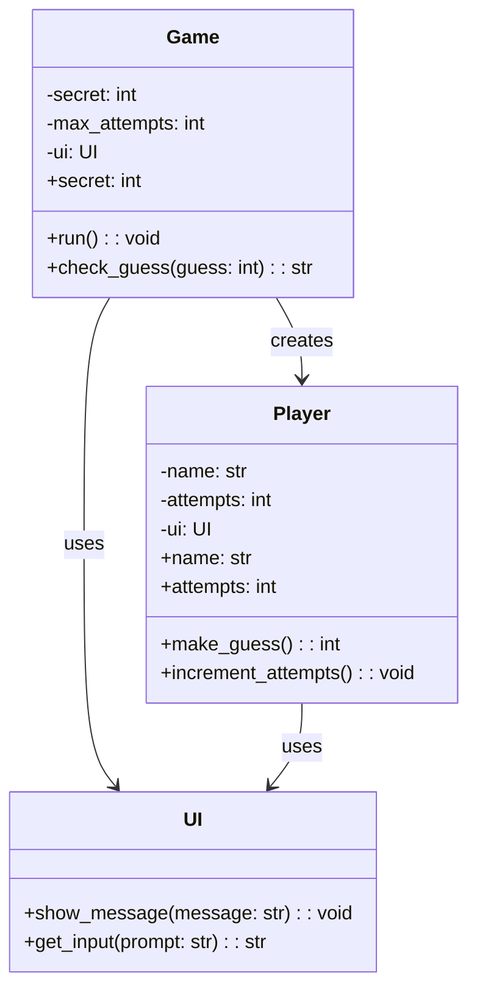

```mermaid
classDiagram
    class Game {
        -secret: int
        -max_attempts: int
        -ui: UI
        +run(): void
        +check_guess(guess: int): str
        +secret: int
    }
    class Player {
        -name: str
        -attempts: int
        -ui: UI
        +make_guess(): int
        +increment_attempts(): void
        +name: str
        +attempts: int
    }
    class UI {
        +show_message(message: str): void
        +get_input(prompt: str): str
    }
    Game --> UI : uses
    Game --> Player : creates
    Player --> UI : uses
```